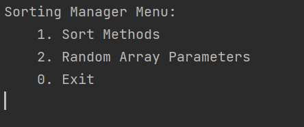
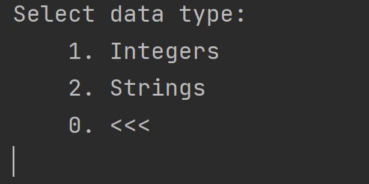
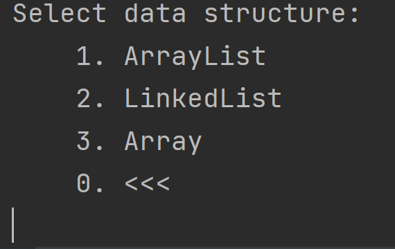
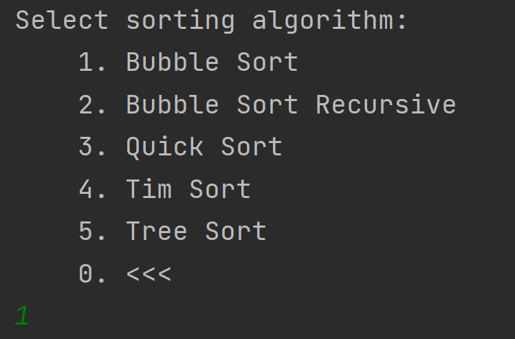
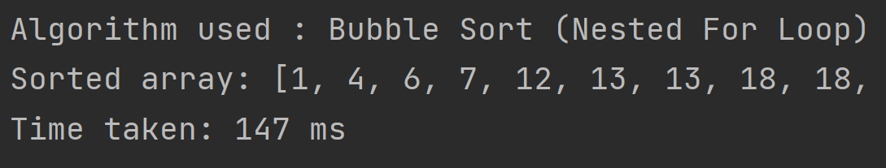

<div id="top"></div>
<div align="center">
   <a href="https://github.com/KonradDlugosz/SortingManager">
    
  </a>
    <h2 align= "center">Sorting Manager Project</h2>
</div>


### Table of content:

1. [About The Project](#About-The-Project)
2. [Getting Started](#Getting-Started)
3. [User Interface](#User-Interface)
4. [Data Structures](#Data-Structures) 
5. [Sorting Algorithms](#Sorting-Algorithms)
6. [Object Oriented Principles](#Object-Oriented-Principles ) 
7. [Design Patterns](#Design-Patterns)
7. [Testing](#Testing)
7. [Logging](#Logging)
8. [Extra Features](#Extra-Features)


### About The Project

This is a individual project which was developed during Sparta Global Academy training. The purpose of this project is to demonstrate understating of concepts covered in the training. For example object oriented principles like SOLID which helps engineers to avoid issues and to build adaptive, effective and agile software. 

The main functionality of this project is allow user to sort an array of integers or strings. This can be done using different [data structures](#Data-Structures) and varies of [sorting algorithms](#Sorting-Algorithms). As an extra feature, the sorting algorithms are timed which shows performance of given algorithm.  Of course, this will vary deepening on the size of an array. Also other process running in the background could effect the performance, therefore the timing might not be consistent every time. 

<p align="right">(<a href="#top">back to top</a>)</p>

### Getting Started

This section will walk you through on how to run this project on your machine. 

Make sure that you have JDK installed on your machine in order to compile the code and run the app. 

1. Clone the repository 

   ````sh
   git clone https://github.com/KonradDlugosz/SortingManager.git
   ````

2. Open command prompt (Windows) or terminal (Mac/Linux) and navigate to cloned repository. 

3. Once in the repo, make sure you are in the folder where `SortingDriver.java` is located. 

4. Compile the code

   ```sh
   javac SortingDriver.java
   ```

5. Run the program

   ```sh
   java SortingDriver
   ```

<p align="right">(<a href="#top">back to top</a>)</p>

### User Interface

The user interface was made using output to the console which than a user can type in a number to navigate through the application. This was achieved using loops to display the content. Here is the menu descriptions and how to use it. 

##### Main menu:

*This menu will show up first once you run the application :* 




**Option 1:** 

* Once you enter number **1**, it will ask you what data type you would like to sort: 



* After that you will be asked what data structure you would like to use: 

  

* Lastly, you will be asked to select sorting algorithm: 

  

* This than will show sorted array and time taken by the sorting algorithm. In this example I have chosen Bubble Sort. Please note that the whole array did not fit in the screen shot.




**Option 2:**  This option allows the user to view current random array and the parameters that are used to generate it. 

**Option 3:** This option allows the user to update the random array parameters in order to set up the array to their preferences. 

**Option 4:**  This will run all the sorting algorithms and generate a report of how long each one took to sort given array. 

**Option 0:** This is used to exit the application. 

*Please note that you can use option 0 at any given time to go back between the menus*

<p align="right">(<a href="#top">back to top</a>)</p>

### Data Structures 

In order to make this project more interesting, I have implemented sorting algorithms using generic class to allow different data structures to be passed as parameters. At the moment, the user can chose from the following options: 

1. Array 
2. Array List 
3. Linked List

Moreover, by using generic class it will be easier to add other data structures as it wouldn't require any refactoring of the classes.  

<p align="right">(<a href="#top">back to top</a>)</p>

### Sorting Algorithms

Multiple sorting algorithms have been implemented to allow a user to have choice of the sorting algorithms and see how they perform against each other. Here is a list of implemented sorting algorithms:

1. Bubble Sort using nested loops 
2. Bubble Sort using recursion
3. Quick Sort 
4. Tim Sort using build-in function 
5. Tree Sort  

All these sorting algorithms implement Sorter interface in order to archive total abstraction. This technique allowed me to achieve loose coupling. 

<p align="right">(<a href="#top">back to top</a>)</p>

### Object Oriented Principles 

In order to achieve reusable and clean code I have followed object oriented principles when developing this project. The main principles that I have implemented my code to were:

* **Abstraction** by using interfaces and then create classes that implement these interfaces. The main use of this principle was applied in sorting algorithms classes where implemented the sorter interface. 
* **Encapsulation** to hind certain details and only show essential part of code to given class. This was archived using getters and setters.  For example, array generator parameters. 
* **Polymorphism** made a big difference to sorting algorithms when different data structure had to be used. This allowed me to make these methods share common methods and therefore allowed reusability and code reduction.  

Moreover, I have also made sure that my code follows SOLID principles. 

* **S**  - classes only focus on performing one task and there is no more than one reason to change it. 

* **O** - classes are open for extension but closed for modification. They allow to be inherited from unless closed for security reasons. 
* **L** - enables to replace objects from superclass with object of subclass without breaking the application. 
* **I** - Interfaces are not combined unnecessary and classes are not forced to implemented methods that they don't depend on.
* **D** - High level classes like main method don't import anything from low level classes. Both depend on abstraction.  

<p align="right">(<a href="#top">back to top</a>)</p>

### Design Patterns

#### Model-View-Controller

I have used design patterns when implementing this application in order to show relationship and interaction between classes and objects. One of the main patterns used in the project was Model-View-Controller to split the application into different areas that helped me manage the application. 

**Model** - This package contains classes that were responsible for processing. For example sorting algorithms and their interface, array generators and time report generator. It also contains factory methods. 

**View** - This package contains classes that are responsible for viewing results as well as menus to the user.

**Controller** - This package contains classes responsible for interaction between the user and the application. It takes user input and decides what classes and objects need to be called in order to satisfy user requirement. 

#### **Factory Methods**

Another design pattern that came handy to solve problem of creating instances of sorting classes is factory method. I have used this pattern in two occasions. 

**Factory method for sorting** - This method takes user input and depending on the input it will decide what instance of sorter interface should be created and used. This allowed me to avoid creating instances of every sorting method.  Code snippet of how the method looks like:

```java
private static Sorter sorter;

public static Sorter sortingFactory(int selected) {

    if(selected == 1){
        sorter = new BubbleSortImpl();
    } else if(selected == 2){
        sorter = new BubbleSortRecursionImpl();
    } else if (selected == 3){
        sorter = new QuickSortImpl();
    } else if (selected == 4){
        sorter = new TimSortImpl();
    } else if (selected == 5){
        sorter = new TreeSortImpl();
    }

    return sorter;
}
```

**Factory method for data structure** - This method also takes user input which decides which instance to create of list data structure. Code snippet of how the method looks like: 

```java
public  List <T> list;
public List listFactory(T [] arr, int selected) {
    if(selected == 1){
        list = new ArrayList<>(List.of(arr));
    } else if(selected == 2){
        list = new LinkedList<>(List.of(arr));
    }
    return list;
}
```

<p align="right">(<a href="#top">back to top</a>)</p>

### Testing

In order to make bug detection easier I have implemented JUnit testing. I have not covered 100% of the code, however I have covered most of the processing code which is most likely to rise bugs. 

Here is an example of Junit testing for negative array length which should return empty array instead of error exception. 

````Java
@Test
@DisplayName("3. Given negative length array, Return empty array")
public void givenNegativeLengthArrayReturnEmptyArrayMethod2(){
    ArrayIntegerGenerator arrayIntegerGenerator = new ArrayIntegerGenerator(-10, 1,1000, 50);
    Integer [] actual = arrayIntegerGenerator.generateArray();
    sorter.sortingAlgorithm(actual);
    int [] expected = {};
    
    assertEquals(Arrays.toString(expected), Arrays.toString(actual));
}
````

<p align="right">(<a href="#top">back to top</a>)</p>

### Logging

Logs are useful to detect common mistake that users make. This project uses log4j2 to record user activity which can provide accurate context about what user was doing when a specific error happened. 

Example of logging file: 

```
[INFO] 2021-12-02 09:57:47,477 main Sorting Manager - User selected: Sorting menu
[INFO] 2021-12-02 09:57:56,777 main Sorting Manager - Data structure choice: ArrayList
[INFO] 2021-12-02 09:58:00,716 main Sorting Manager - Running bubble sort...
[INFO] 2021-12-02 09:58:04,989 main Sorting Manager - Running bubble sort recursive...
[INFO] 2021-12-02 09:58:07,357 main Sorting Manager - Running quick sort...
[INFO] 2021-12-02 09:58:09,778 main Sorting Manager - Running tim sort...
[INFO] 2021-12-02 09:58:11,362 main Sorting Manager - Running tree sort...
[INFO] 2021-12-02 09:58:14,992 main Sorting Manager - Data structure choice: LinkedList
[INFO] 2021-12-02 09:58:16,464 main Sorting Manager - Running bubble sort...
[INFO] 2021-12-02 09:58:20,792 main Sorting Manager - Running bubble sort recursive...
[INFO] 2021-12-02 09:58:23,435 main Sorting Manager - Running quick sort...
[INFO] 2021-12-02 09:58:25,459 main Sorting Manager - Running tim sort...
[INFO] 2021-12-02 09:58:27,086 main Sorting Manager - Running tree sort...
[ERROR] 2021-12-02 09:58:30,443 main Sorting Manager - Wrong input for the menu! | Entered: 7657
[INFO] 2021-12-02 09:58:37,643 main Sorting Manager - Data structure choice: ArrayList
[INFO] 2021-12-02 09:58:38,775 main Sorting Manager - Running bubble sort...
[INFO] 2021-12-02 09:59:01,942 main Sorting Manager - User updated random integer array params: Length: 10000 Start: 1 End: 100000 Seed: 40
[INFO] 2021-12-02 09:59:09,191 main Sorting Manager - Display current integer array
[INFO] 2021-12-02 09:59:32,282 main Sorting Manager - User updated random string array params: Length: 1000 Char per string: 10 Seed: 40
[INFO] 2021-12-02 09:59:34,874 main Sorting Manager - Display current string array
[INFO] 2021-12-02 09:59:46,406 main Sorting Manager - User selected: Sorting menu
[INFO] 2021-12-02 09:59:51,274 main Sorting Manager - Data structure choice: ArrayList
[INFO] 2021-12-02 09:59:52,057 main Sorting Manager - Running bubble sort...
[INFO] 2021-12-02 09:59:57,079 main Sorting Manager - Exit application
```

<p align="right">(<a href="#top">back to top</a>)</p>

### Extra Features

As an programming extra feature I have applied the concept of using streams to preform certain actions. 

For example, I have used streams to generate random array of integers: 

```java
IntStream.range(0, length).forEach(i -> arr[i] = random.nextInt(start, end));
```

<p align="right">(<a href="#top">back to top</a>)</p>
