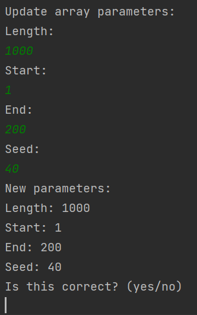

# Sorting Manager

### Index: 

1. [**Description**](#Description )
2. [**User interface**](#User-interface)

#### Description 

Java application for sorting an array of numbers. It allows the user to select given sorting algorithm by selecting option 1 from main menu which includes: 

1. Bubble Sort (Nested for loop)
2. Bubble Sort (Recursive)
3. Quick Sort

The user also can generate random array by selecting option 2 from main menu and specify:

1. Length
2. Start 
3. End
4. Seed. 

#### User interface

##### Main menu:

*This shows the main selections of available functions:* 

##### Algorithm menu: 

*This shows all the available sorting algorithms: *

##### Random Array: 

*This shows how user can update random array generator parameters:*

